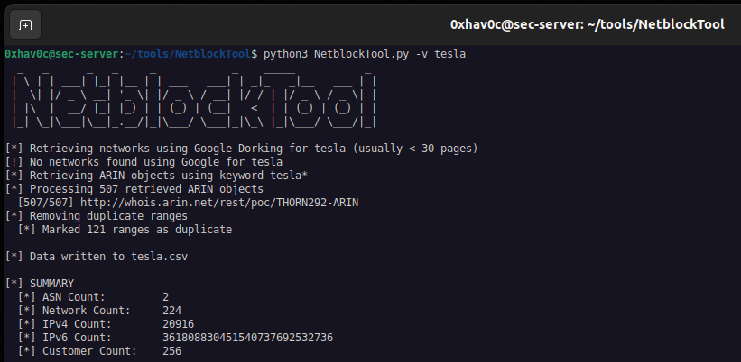
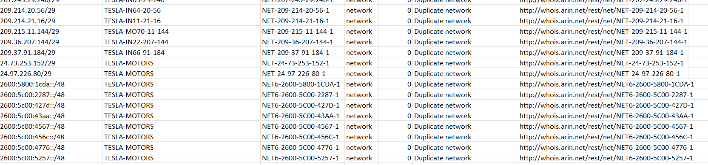
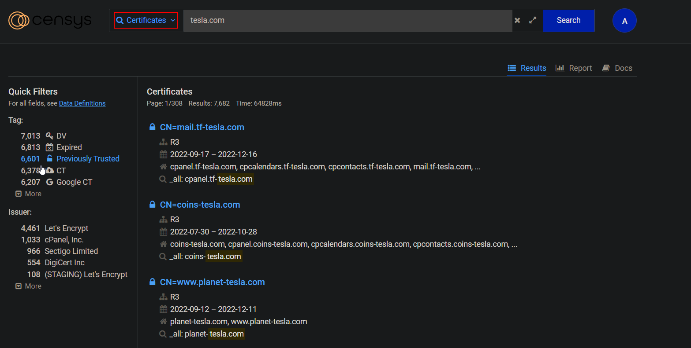
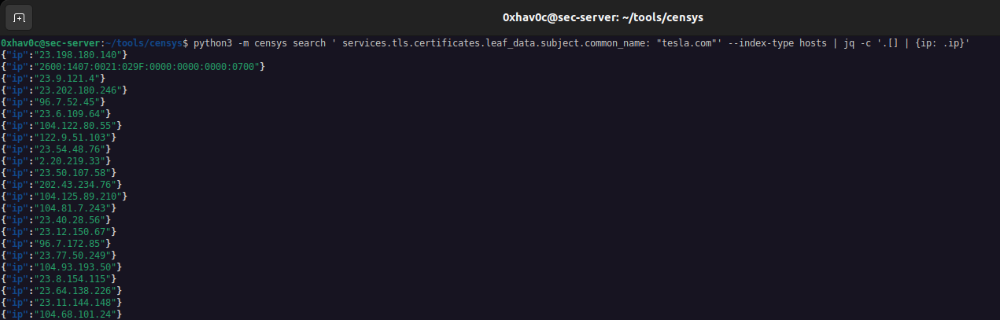
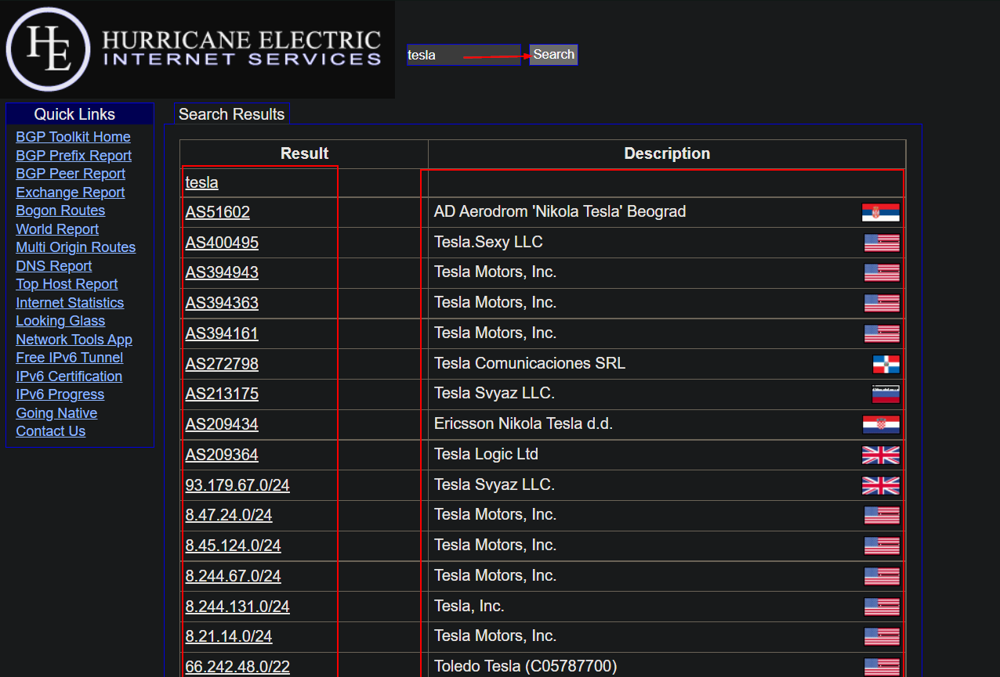
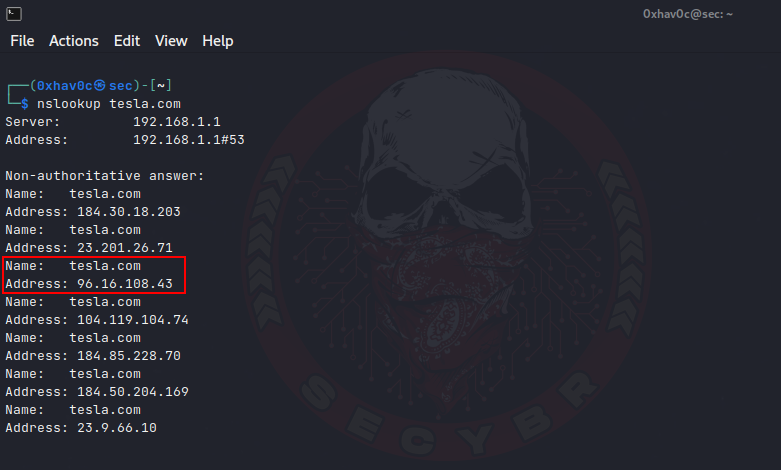
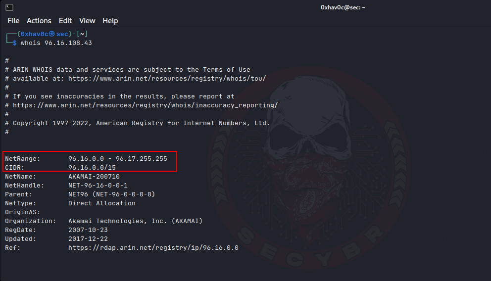

Finding Netblock Addres From Company Name

You can find NetblockTool on Github.

| 1 2 3 4 5 6 7 8 9 10 11  | \#NetblockTool \#Simple run. Get results from Google dorking and ARIN database: python3 NetblockTool.py Company \#Include the verbose flag to print status updates: python3 NetblockTool.py -v Company \#Extract netblocks owned by your target company’s subsidiaries: python3 NetblockTool.py -v Company -s \#Extract point of contact information: python3 NetblockTool.py -v Company -p \#Get as much information as possible, including netblocks found using wildcard queries, points of contact, geolocation data, and physical addresses: python3 NetblockTool.py -wpgav Company -so  |
|--------------------------|-----------------------------------------------------------------------------------------------------------------------------------------------------------------------------------------------------------------------------------------------------------------------------------------------------------------------------------------------------------------------------------------------------------------------------------------------------------------------------------------------------------------------------------------------------------------------------------------------|

NetblockTool.py outputNetblockTool.py .csv output example

Finding Assets From IP Databases

Finding IP Address From SSL Certificates on Censys.io

You can use [censys.io](https://search.censys.io/) as one of the fast and creative solutions for detecting IP addresses. With this method, by searching the domain name in the SSL certificates in the [Censys.io](http://censys.io/) database, you can obtain all the addresses that the target domain name is passing through.

Censys.io searching certificates.

Or you can use this command. But firstly, you have to install python-censys libary. You can install from [here](https://github.com/censys/censys-python).

| 1 2 3  | python3 -m censys search ' services.tls.certificates.leaf_data.subject.common_name: "example.com"' --index-type hosts \| jq -c '.[] \| {ip: .ip}' \> ip.txt \#You can pars output with this command sed -i 's/[\^0-9,.]\*//g' ip.txt  |
|--------|---------------------------------------------------------------------------------------------------------------------------------------------------------------------------------------------------------------------------------------|

Using censys libary of python.

Finding Organization ASN & Netblock IP Address with BGP

You can find out the Autonomous System Number (ASN) number by searching the keywords of the Organization through the application of BGP [here](https://bgp.he.net/).

Finding Organization ASN & Netblock IP Address with BGP

Finding Netblock IP Address CIDR with nslookup & whois

With the Whois information, a lot of information about the domain name can be accessed. Our goal in this technique is to detect Netblock and CIDR addresses to expand the attack surface. For this, after the address is detected with the help of nslookup, a whois query is sent to this address and the Netblock and CIDR to which this IP address belongs are detected.

In order to expand the attack surface as much as possible in the target organization, we first need the domain and subdomain addresses. Before applying this method, you should collect as many domains and subdomains as possible.

Finding Netblock IP Address CIDR with nslookup & whois

Finding Netblock IP Address CIDR with nslookup & whois
