Recon-ng Basics

Firstly we need to create a workspaces related to the target organization. It will gather our research and findings under these workspaces.

| 1 2  | workspaces list workspaces create example-name  |
|------|-------------------------------------------------|

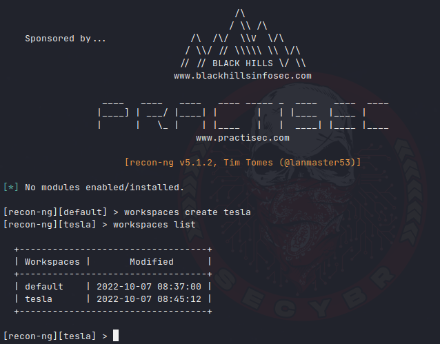

You can create and list companies.

| 1 2  | db insert companies show companies  |
|------|-------------------------------------|

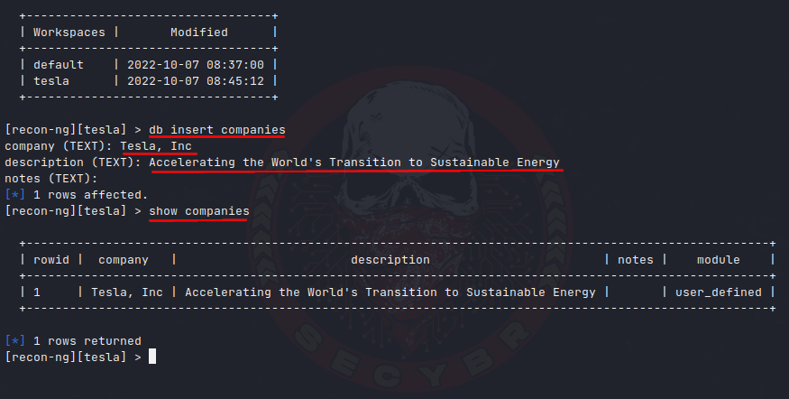

You can add a domain name and list it.

| 1 2  | db insert domains show domains  |
|------|---------------------------------|

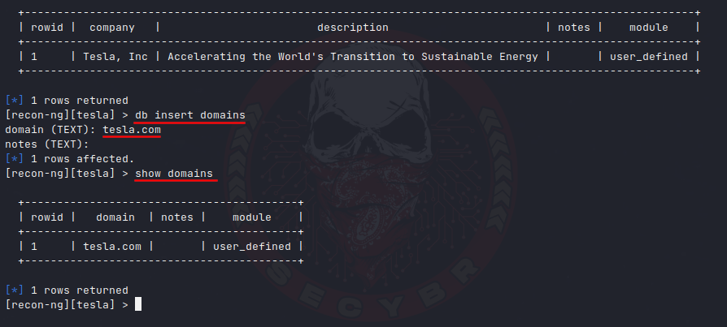

API KEYS

You can find the Recon-ng API Key source [here](https://github.com/Raikia/Recon-NG-API-Key-Creation/blob/master/README-v4.8.3.md).

You can list keys, and add keys.

| 1 2 3  | keys list \#list the keys keys add example_api xxxxxxxxxxxxxxxxxxxxx \# adding API key to module. keys add binaryedge_api b8880xxxxxxxxxxxxxxxxx \# example add api key  |
|--------|--------------------------------------------------------------------------------------------------------------------------------------------------------------------------|

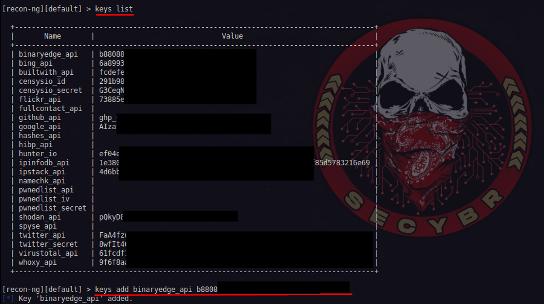

Modules

You can see the modules that can be installed on recon-ng with the marketplace command.

| 1  | marketplace search  |
|----|---------------------|

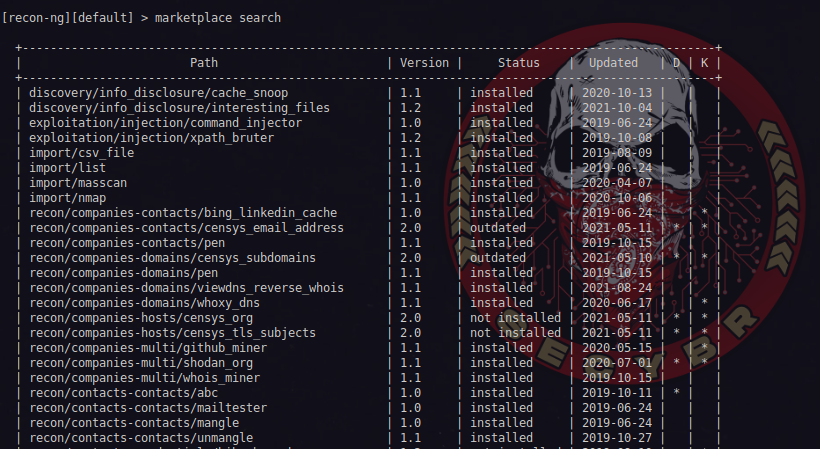

Modülleri yüklemek için aşağıdaki komutları kullanabilirsiniz

| 1 2 3 4 5 6  | \# To load all modules marketplace install all \# This command will load all supported or unsupported modules doe, but you may get some errors about censys libraries due to some incompatibilities with python 3.10. \# To load modules one by one marketplace install path \# So like this marketplace install recon/companies-contacts/bing_linkedin_cache   \#Note: You may get an error because you did not add the APIs. Not all modules need API. But when adding the modules you need to the API, if the required API value is not available, you will get an error.  |
|--------------|-------------------------------------------------------------------------------------------------------------------------------------------------------------------------------------------------------------------------------------------------------------------------------------------------------------------------------------------------------------------------------------------------------------------------------------------------------------------------------------------------------------------------------------------------------------------------------|

You can list installed modules.

| 1  | modules search  |
|----|-----------------|

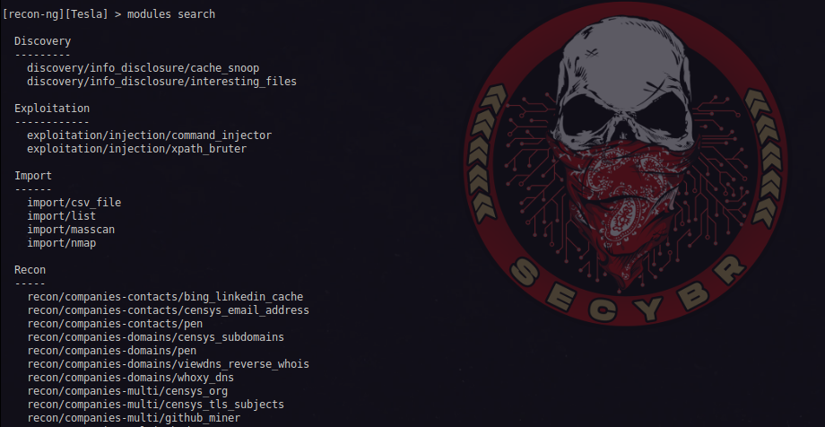

Start Recon to Targets

We can select the module we want to run and start the recon as follows.

| 1 2 3 4  | modules load recon/hosts-ports/censys_ip options set SOURCE example.com options set VIRTUAL_HOSTS EXCLUDE \# You have three option about this settings = EXCLUDE, INCLUDE, ONLY run  |
|----------|--------------------------------------------------------------------------------------------------------------------------------------------------------------------------------------|

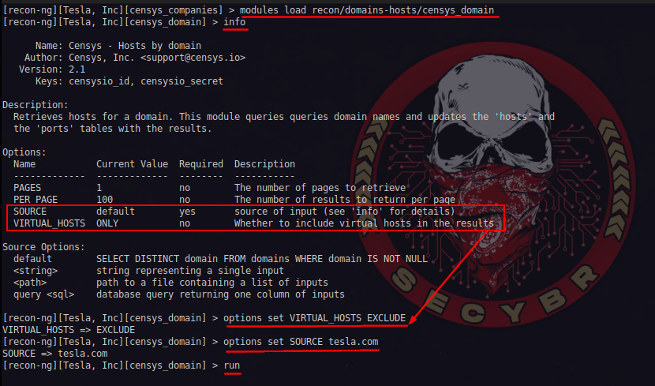

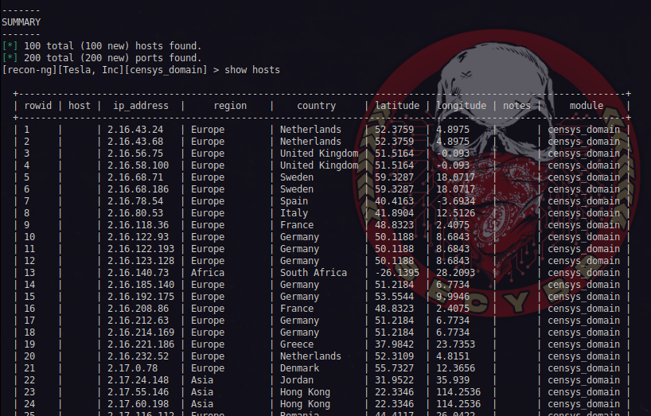

We can get reports with the help of the following commands in the workspaces where we have completed our tasks.

| 1 2 3 4 5 6 7  | modules search reporting\* \# You can search modules with '\*'. There is some different reporting methods. modules load reporting/html info options set FILENAME /home/user/Desktop/results.html options set CUSTOMER Company Name options set CREATOR 0xhav0c run  |
|----------------|---------------------------------------------------------------------------------------------------------------------------------------------------------------------------------------------------------------------------------------------------------------------|

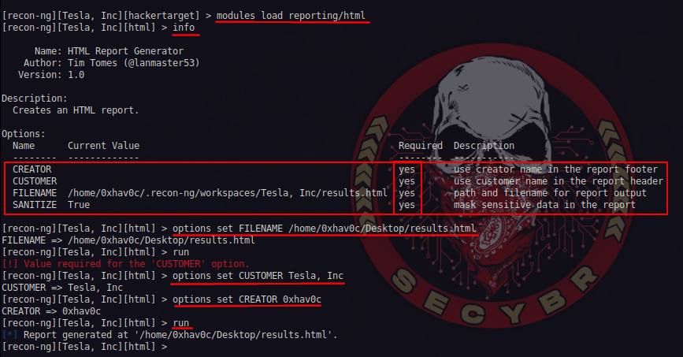

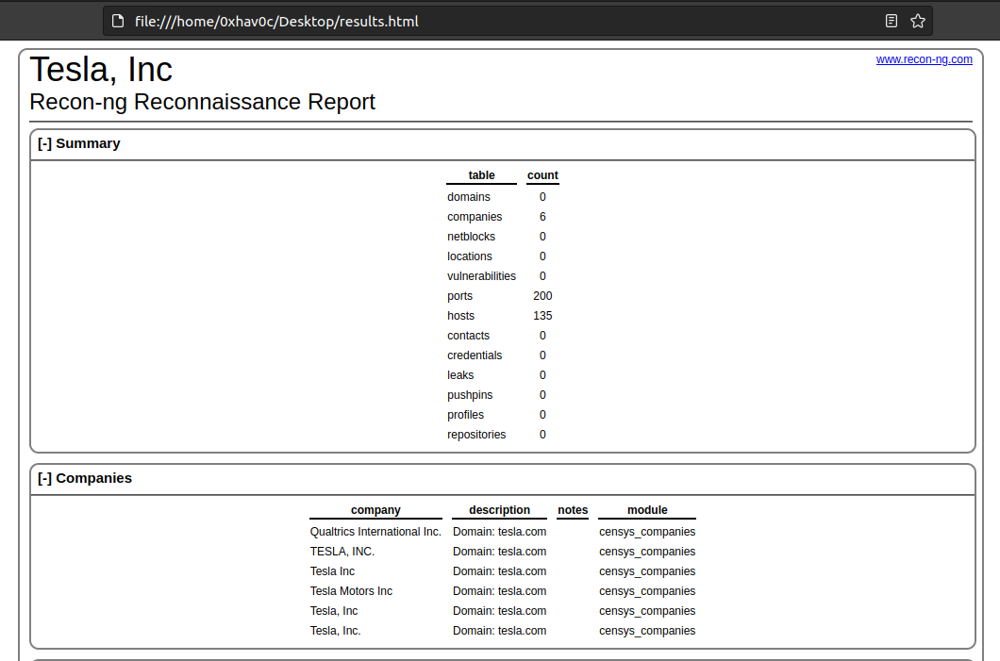

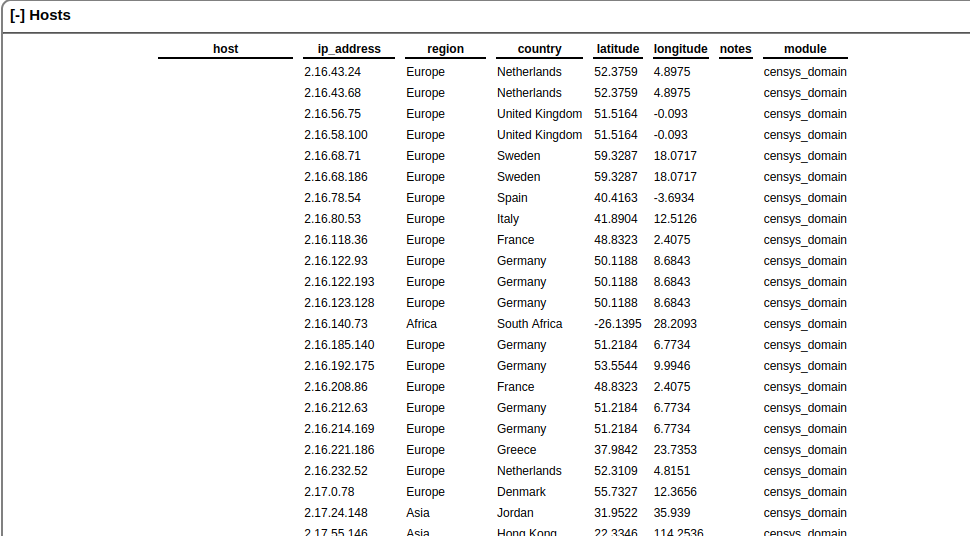

[red team](https://secybr.com/categories/red-team/), [reconing](https://secybr.com/categories/reconing/)
