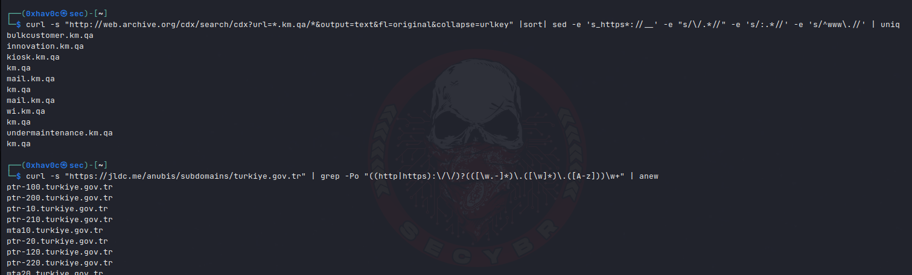
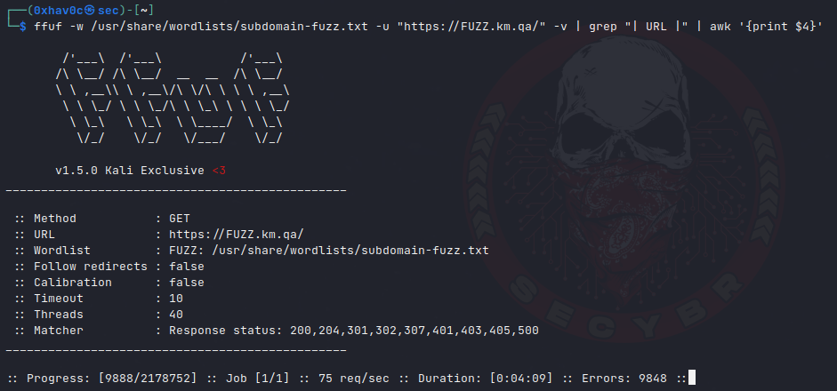
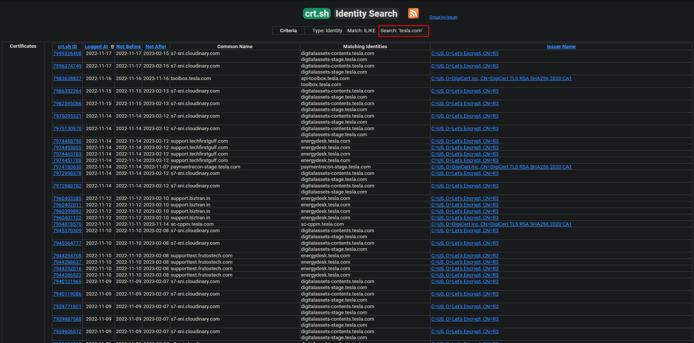

Subdomain Enumeration Methods

Posted Dec 1, 2022 Updated Feb 12, 2023

By [0xhav0c](https://twitter.com/0xhav0c)

2 min read

One of the first things to do in the discovery phase is to collect as many systems and IP addresses as possible without touching them. First of all, we need to find domains and subdomains. In this section, I will show you some of the subdomain enumeration methods.

Collecting Subdomains with Tools

Curl & Parsing

| 1 2 3 4  | \#web.archive.org Parsing For Subdomains curl -s "http://web.archive.org/cdx/search/cdx?url=\*.hackerone.com/\*&output=text&fl=original&collapse=urlkey" \|sort\| sed -e 's_https\*://__' -e "s/\\/.\*//" -e 's/:.\*//' -e 's/\^www\\.//' \| uniq \#Search subdomains using jldc curl -s "https://jldc.me/anubis/subdomains/att.com" \| grep -Po "((http\|https):\\/\\/)?(([\\w.-]\*)\\.([\\w]\*)\\.([A-z]))\\w+" \| anew  |
|----------|----------------------------------------------------------------------------------------------------------------------------------------------------------------------------------------------------------------------------------------------------------------------------------------------------------------------------------------------------------------------------------------------------------------------------|

Collecting subdomains with curl from web.archive.org & jldc.me

amass

| 1 2 3 4  | amass enum -d example.com -src -ip -dir example amass enum -d example.com -src -ip -norecursive amass enum -d example.com -src -ip -brute -dir example amass viz -dir example -d3 \#For Graphical Surface  |
|----------|------------------------------------------------------------------------------------------------------------------------------------------------------------------------------------------------------------|

theHarvester

| 1 2 3 4 5 6 7 8 9 10  | theHarvester -d example.com -l 500 -b all theHarvester -d example.com -c theHarvester -d example.com -l 500 -b google,bing,yahoo,duckduckgo -n  \# -d Domain field \# -b Sources \# -n Enable DNS Server lookup  \#All Sources : anubis, baidu, bevigil, binaryedge, bing, bingapi, bufferoverun, censys, certspotter, crtsh, dnsdumpster, duckduckgo, fullhunt, github-code, hackertarget, hunter, intelx, omnisint, otx, pentesttools, projectdiscovery, qwant, rapiddns, rocketreach, securityTrails, sublist3r, threatcrowd, threatminer, urlscan, virustotal, yahoo, zoomeye  |
|-----------------------|------------------------------------------------------------------------------------------------------------------------------------------------------------------------------------------------------------------------------------------------------------------------------------------------------------------------------------------------------------------------------------------------------------------------------------------------------------------------------------------------------------------------------------------------------------------------------------|

Other Tools

| 1 2 3 4 5 6 7 8 9 10 11 12 13 14 15 16 17 18 19 20 21 22 23 24 25 26 27 28 29 30 31  | \#findomain \#\# Repository: https://github.com/Findomain/Findomain findomain -t target.com -o  \#Using jhaddix All.txt \#\# List : https://gist.github.com/jhaddix/86a06c5dc309d08580a018c66354a056 \#\# Warning! If you use this repository, you can get blocked by waf/IPS etc. Because it generates traffic on hundreds of target domains per second. ffuf -w all.txt -u "https://FUZZ.example.com/" -v \| grep "\| URL \|" \| awk '{print \$4}'  \#Gospider \#\#Repository: https://github.com/tomnomnom/anew \| https://github.com/jaeles-project/gospider gospider -d 0 -s "https://example.com" -c 5 -t 100 -d 5 --blacklist jpg,jpeg,gif,css,tif,tiff,png,ttf,woff,woff2,ico,pdf,svg,txt \| grep -Eo '(http\|https)://[\^/"]+' \| anew  \#subfinder \#\#Repository: https://github.com/projectdiscovery/subfinder subfinder -d example.com -o example.com_subfinder.txt  \#assetfinder \#\# Repository: https://github.com/tomnomnom/assetfinder assetfinder --subs-only example.com  \#knockpy \#\# Repository: https://github.com/guelfoweb/knock python3 knockpy.py example.com  \#sudomy \#\# Repository: https://github.com/screetsec/Sudomy bash sudomy -s shodan,dnsdumpster,webarchive -d example.com bash sudomy -pS -sC -sS -d example.com bash sudomy -d example.com -rS --html bash sudomy -d example.com --all  |
|--------------------------------------------------------------------------------------|---------------------------------------------------------------------------------------------------------------------------------------------------------------------------------------------------------------------------------------------------------------------------------------------------------------------------------------------------------------------------------------------------------------------------------------------------------------------------------------------------------------------------------------------------------------------------------------------------------------------------------------------------------------------------------------------------------------------------------------------------------------------------------------------------------------------------------------------------------------------------------------------------------------------------------------------------------------------------------------------------------------------------------------------------------------------------------------------------------------------------------------------------------------------------------------------------------------------------------------------------------------------------------------------------------------------------------------|

Fuzzing with ffuf

Certificate Search

You can find subdomains with certificates by searching target domains in online certificate databases. Example site: [https://crt.sh](https://crt.sh/)

Subdomain enumeration from check the https://crt.sh

Parsing to Valid Subdomains

| 1 2 3  | \#target.com.txt= Detected address list \#target.com_valid.txt= parsed valid domain list while read i; do digout=\$(dig +short \${i//[\$'\\t\\r\\n ']}); if [[ ! -z \$digout ]]; then echo \${i//[\$'\\t\\r\\n ']}; fi; done \< target.com.txt \> target.com_valid.txt  |
|--------|-------------------------------------------------------------------------------------------------------------------------------------------------------------------------------------------------------------------------------------------------------------------------|

[red team](https://secybr.com/categories/red-team/), reconing
